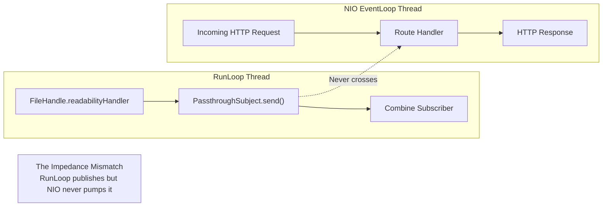
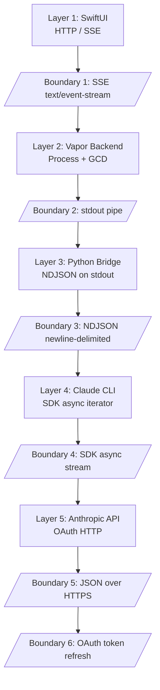

## 5 Layers to Call an API

I needed to call one API. It took five layers, four failed attempts, and thirty hours of debugging to get there.

This is the story of connecting an iOS app to Claude Code — a problem that sounds like it should take an afternoon and instead became a two-week debugging odyssey. The working solution has five layers of indirection between the user tapping "Send" and Claude receiving the prompt. Every layer exists because I tried to remove it and failed.

The companion repo has all four failed attempts with real code and the working bridge: [github.com/krzemienski/claude-sdk-bridge](https://github.com/krzemienski/claude-sdk-bridge)

---

### The Obvious Approach (And Why It Dies Immediately)

When you want to call an API from an app, the obvious architecture is: app calls API. Three lines of meaningful code. Here is what that looks like:

```python
# From: failed-attempts/01-direct-api/attempt.py

client = anthropic.Anthropic()

with client.messages.stream(
    model="claude-sonnet-4-20250514",
    max_tokens=4096,
    messages=[{"role": "user", "content": prompt}],
) as stream:
    for text in stream.text_stream:
        collected_text += text
        print(text, end="", flush=True)
```

Clean. Elegant. Dead on arrival.

The error is immediate and clear:

```
anthropic.AuthenticationError: No API key provided.
Set ANTHROPIC_API_KEY environment variable or pass api_key parameter.
```

Claude Code does not use API keys. It uses browser-based OAuth authentication. The session tokens are managed internally by the CLI and stored in `~/.claude/`. They are not exposed through environment variables or any public API.

You could ask users to create a separate API key through the Anthropic Console. But that defeats the purpose of building a client for Claude Code — users would need separate billing, lose access to Claude Code features like tools and MCP servers, and pay twice. Half a day lost. The least painful failure on the list, because at least the error message was clear.

---

### The Silent Failure (Two Days, Zero Error Messages)

Attempt 2 was the one that nearly broke me. Anthropic ships a Swift SDK — ClaudeCodeSDK — designed for exactly this scenario. Same language as our backend. Same ecosystem. It wraps the Claude CLI process and provides a publisher-based streaming interface. It should have worked.

```swift
// From: failed-attempts/02-claude-code-sdk/attempt.swift

func attemptClaudeCodeSDK(req: Request) async throws -> Response {
    let claude = ClaudeCodeProcess()
    claude.arguments = ["-p", "--output-format", "stream-json"]

    let stream = claude.stream(prompt: "Say hello")

    var response = ""
    for try await chunk in stream {
        response += chunk  // Never reached
    }

    return Response(status: .ok, body: .init(string: response))
}
```

Nothing happened. No errors. No crashes. No output. The `AsyncStream` returned by the SDK simply never yielded a single value. The loop runs forever, waiting for data that will never arrive.

Here is what is happening under the hood. The SDK internally uses `FileHandle.readabilityHandler` to read stdout from the Claude CLI subprocess. That handler dispatches through `RunLoop`. The events flow through a Combine `PassthroughSubject`, which also depends on `RunLoop` scheduling. But our backend is Vapor, which runs on SwiftNIO. SwiftNIO uses its own `EventLoop` implementation — not `RunLoop`. The NIO event loops never pump `RunLoop`. So:

1. The Claude CLI process spawns correctly
2. Claude receives the prompt and generates a response
3. Bytes arrive on stdout
4. `readabilityHandler` fires and reads the data
5. `PassthroughSubject.send()` is called with the data
6. The subscriber callback never executes — no `RunLoop` iteration delivers the event

The data exists. It was read. It was sent into the publisher. And then it vanishes into a scheduling void.



I tried three workarounds. Manually pumping `RunLoop` on a background thread — deadlock. `DispatchQueue.main.async` wrapper — moved the silent failure to a different layer. Dedicated `Thread` with its own `RunLoop` — event ordering issues and more deadlocks. None of them worked because this is an architectural incompatibility, not a bug.

Two full days. Most of that time was spent verifying the SDK was receiving data — adding logging at every layer, confirming `PassthroughSubject.send()` was being called, slowly narrowing the gap to the subscriber side. The silence was the hardest part. If the SDK had thrown an error or logged a warning, this would have been a thirty-minute fix.

---

### The Wrong Language

Attempt 3 was the JavaScript SDK. Same authentication wall as Attempt 1 (OAuth, not API keys), plus the unnecessary overhead of adding a Node.js runtime to a Swift backend. Even the Node.js Agent SDK has environment variable inheritance issues when spawned from within a Claude Code session.

```javascript
// From: failed-attempts/03-js-sdk/attempt.js

const client = new Anthropic();

const stream = await client.messages.stream({
    model: "claude-sonnet-4-20250514",
    max_tokens: 4096,
    messages: [{ role: "user", content: prompt }],
});
```

Same error. Different language. A few hours wasted before recognizing the pattern and moving on.

---

### Three Lines, Ten Hours

Attempt 4 got tantalizingly close. Bypass all SDKs. Spawn the Claude CLI directly as a `Process` (formerly `NSTask`) with GCD-based stdout reading. No `RunLoop` dependency, no Combine, just `DispatchQueue` handlers on a `Pipe`.

It worked perfectly from a standalone terminal. It failed silently when running inside an active Claude Code session.

```swift
// From: failed-attempts/04-cli-subprocess/attempt.swift

func executeClaudeDirectly(prompt: String) async throws -> String {
    let process = Process()
    process.executableURL = URL(fileURLWithPath: "/usr/local/bin/claude")
    process.arguments = ["-p", prompt, "--output-format", "stream-json"]

    let stdoutPipe = Pipe()
    process.standardOutput = stdoutPipe

    // BUG: This inherits ALL environment variables from the parent process,
    // including CLAUDECODE=1 and CLAUDE_CODE_* if running inside Claude Code.
    // The child Claude CLI detects these and silently refuses to execute.

    try process.run()
    process.waitUntilExit()
    // ...
}
```

The symptom: Claude CLI exits immediately with no output. No error, no stderr, just a zero-byte response. The cause: environment variable inheritance. Claude Code sets `CLAUDECODE=1` and `CLAUDE_CODE_*` variables in its process environment. Child processes inherit these. The CLI's nesting detection mechanism silently refuses to execute when it detects a parent Claude Code session.

The fix was three lines:

```swift
// From: failed-attempts/04-cli-subprocess/attempt.swift

var env = ProcessInfo.processInfo.environment
env.removeValue(forKey: "CLAUDECODE")
env = env.filter { !$0.key.hasPrefix("CLAUDE_CODE_") }
process.environment = env
```

Three lines. Ten hours to discover them. The environment-dependent failure — works in terminal, fails in Claude Code — made it extremely hard to diagnose. Environment variables are ambient authority. The subprocess did not ask to be inside a Claude Code session. It inherited that context silently and failed silently.

And there was a bonus bug: accessing `process.terminationStatus` after reading EOF from stdout caused an `NSInvalidArgumentException` crash. Reading EOF from a pipe does NOT mean the process has exited. There is a race condition between pipe closure and process termination.

---

### The Working Bridge: Why Five Layers Is Simpler

The working solution has five layers. Here is the full path a user's message travels:



Each layer exists because the layer above cannot talk to the layer below without an intermediary. Layer 1 to 2 is standard HTTP. Layer 2 to 3 exists because Swift cannot use the Swift SDK (`RunLoop`/NIO mismatch) and cannot call the API directly (OAuth, not API keys). Layer 3 is Python because the `claude-agent-sdk` package wraps the CLI natively and inherits OAuth authentication. Layer 4 is the CLI because it is the only consumer-accessible interface that handles the OAuth token chain. Layer 5 was never a problem.

The Python bridge itself is around 50 lines of meaningful code. The core is the `isinstance()` dispatch that converts SDK message types to NDJSON:

```python
# From: working-bridge/claude_bridge.py

async for message in query(prompt=prompt, options=options):
    if isinstance(message, SystemMessage):
        pass

    elif isinstance(message, AssistantMessage):
        blocks = [convert_block(b) for b in message.content]
        if blocks:
            got_content = True
        emit({"type": "assistant", "message": {"role": "assistant",
             "content": blocks, "model": getattr(message, "model", None)}})

    elif isinstance(message, ResultMessage):
        got_result = True
        result = {
            "type": "result",
            "subtype": "error" if message.is_error else "success",
            "is_error": message.is_error,
            "session_id": message.session_id or session_id,
            "total_cost_usd": message.total_cost_usd or 0.0,
        }
        emit(result)
```

The block converter uses `isinstance()` for each content type — `TextBlock`, `ToolUseBlock`, `ToolResultBlock`, `ThinkingBlock`:

```python
# From: working-bridge/claude_bridge.py

def convert_block(block) -> dict:
    if isinstance(block, TextBlock):
        return {"type": "text", "text": block.text}
    elif isinstance(block, ToolUseBlock):
        return {
            "type": "tool_use",
            "id": block.id,
            "name": block.name,
            "input": block.input,
        }
    elif isinstance(block, ToolResultBlock):
        return {
            "type": "tool_result",
            "tool_use_id": block.tool_use_id,
            "content": block.content,
            "is_error": block.is_error,
        }
    elif isinstance(block, ThinkingBlock):
        return {"type": "thinking", "thinking": block.thinking}
    else:
        text = getattr(block, "text", None) or str(block)
        return {"type": "text", "text": text}
```

Every write flushes immediately. Without explicit flushing, Python's stdout buffering delays output by unpredictable amounts when writing to a pipe:

```python
# From: working-bridge/claude_bridge.py

def emit(obj: dict) -> None:
    line = json.dumps(obj, separators=(",", ":"))
    sys.stdout.write(line + "\n")
    sys.stdout.flush()  # Critical: force immediate delivery
```

---

### The Swift Side: Environment Sanitization and NDJSON Parsing

The Swift executor spawns the Python bridge, strips the dangerous environment variables, and reads NDJSON from stdout on a dedicated GCD queue:

```swift
// From: working-bridge/executor.swift

// CRITICAL: Strip Claude Code nesting detection env vars.
let escaped = configJson.replacingOccurrences(of: "'", with: "'\\''")
let command = "python3 '\(bridgePath)' '\(escaped)'"
let cleanCmd = "for v in $(env | grep ^CLAUDE | cut -d= -f1); do unset $v; done; \(command)"
process.arguments = ["-l", "-c", cleanCmd]

// Belt-and-suspenders: also strip from Process.environment
var env = ProcessInfo.processInfo.environment
for key in env.keys where key.hasPrefix("CLAUDE") {
    env.removeValue(forKey: key)
}
process.environment = env
```

Belt-and-suspenders: the environment is stripped both in the shell command AND in the `Process.environment` dictionary. Two redundant protections for a bug that took ten hours to find the first time.

The NDJSON reader runs on a dedicated GCD queue with no `RunLoop` dependency. It handles partial lines, buffer accumulation, and the critical `waitUntilExit()` pattern:

```swift
// From: working-bridge/executor.swift

DispatchQueue(label: "bridge-reader", qos: .userInitiated).async {
    let handle = stdoutPipe.fileHandleForReading
    var buffer = Data()

    while true {
        let chunk = handle.availableData
        if chunk.isEmpty { break }

        initialTimeoutWork.cancel()  // Got data, cancel initial timeout
        buffer.append(chunk)

        guard let str = String(data: buffer, encoding: .utf8) else { continue }
        let lines = str.components(separatedBy: "\n")

        if lines.count > 1 {
            for i in 0..<(lines.count - 1) {
                let line = lines[i].trimmingCharacters(in: .whitespacesAndNewlines)
                if !line.isEmpty,
                   let data = line.data(using: .utf8),
                   let json = try? JSONSerialization.jsonObject(with: data)
                       as? [String: Any] {
                    continuation.yield(json)
                }
            }
            buffer = lines.last?.data(using: .utf8) ?? Data()
        }
    }

    // CRITICAL: Always waitUntilExit() before terminationStatus.
    process.waitUntilExit()
    continuation.finish()
}
```

---

### The Counterintuitive Lesson

Five layers sounds overengineered. It sounds like the kind of architecture an astronaut builds when a direct call would suffice. But here is the thing: every "simpler" approach failed. The direct API call (1 layer) hits an authentication wall. The Swift SDK (2 layers) hits a `RunLoop`/NIO mismatch. The CLI subprocess (2 layers) hits nesting detection. The JS SDK (2 layers) hits authentication plus adds an unnecessary runtime.

Five layers works because each layer does exactly one translation:

1. SwiftUI gesture to HTTP request
2. HTTP request to subprocess spawn (with env sanitization)
3. Python SDK call to NDJSON on stdout
4. OAuth-authenticated CLI call
5. HTTP to Anthropic's servers

No layer tries to be clever. No layer combines responsibilities. The `bridge.py` file is ~50 lines. The `executor.swift` is ~210 lines. The total bridge code is smaller than any of the failed attempts because each layer has a single, clear job.

Six serialization boundaries exist in the full round trip. Each one is a potential source of bugs. The text duplication P2 bug — where every response appeared twice — was caused by using `+=` on accumulated text instead of `=` at boundary 5. Two characters. Three hours of debugging. But the serialization boundary made it easy to isolate once I knew where to look.

Total debugging time across all failure modes: approximately thirty hours. Cold start latency: ~12 seconds. Warm latency: ~2-3 seconds. Cost per query: ~$0.04. The bridge has been running in production for months without a single failure mode it was not designed to handle.

Sometimes the "wrong" architecture is the only one that works.

Companion repo: [github.com/krzemienski/claude-sdk-bridge](https://github.com/krzemienski/claude-sdk-bridge)

---

*Part 5 of 11 in the [Agentic Development](https://github.com/krzemienski/agentic-development-guide) series.*

`#AgenticDevelopment` `#ClaudeCode` `#iOSDevelopment` `#SoftwareArchitecture` `#AIEngineering`
